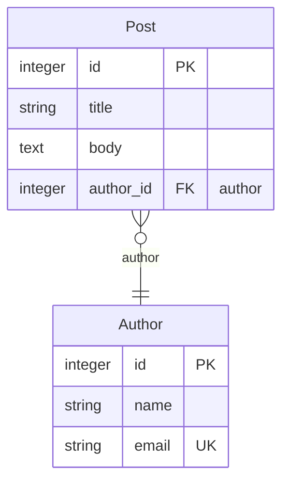
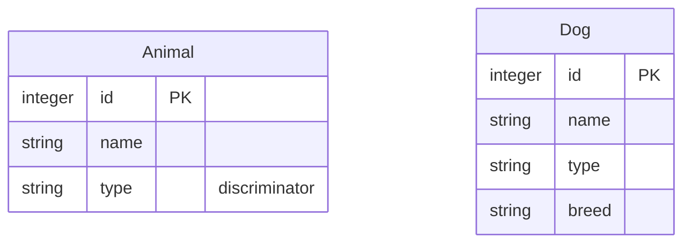

# mikro-orm-markdown

[MikroORM](https://mikro-orm.io) 엔티티에서 **Mermaid ERD + Markdown 문서**를 자동으로 생성합니다.

[](https://badge.fury.io/js/mikro-orm-markdown)
[](https://github.com/iamkanguk97/mikro-orm-markdown/actions)
[](https://opensource.org/licenses/MIT)

[English](./README.md)

> [@samchon](https://github.com/samchon)의 [prisma-markdown](https://github.com/samchon/prisma-markdown)에서 큰 영감을 받았습니다. 좋은 아이디어에 감사드립니다.

## 주요 기능

- **Mermaid ERD 다이어그램** — JSDoc 태그로 원하는 섹션에 묶어서 표현
  - 엔티티별 컬럼 테이블 (타입, 키, nullable 여부, 설명 포함)
  - NamingStrategy가 적용된 실제 DB 컬럼명
  - 인덱스 및 제약 조건
- **실행 중인 DB 연결 불필요** — MikroORM 설정에서 엔티티 메타데이터를 직접 읽습니다
- **드라이버 독립적** — MikroORM 메타데이터를 기반으로 동작하므로 PostgreSQL, MySQL/MariaDB, SQLite, MSSQL 등 SQL 드라이버에서 동작할 수 있습니다. 현재 자동 테스트는 SQLite 기준으로 실행되며, 다른 드라이버는 동작할 것으로 예상하지만 아직 자동화 테스트로 검증하지는 않았습니다.

### MikroORM 고유 개념

Prisma 기반 도구로는 표현할 수 없는 MikroORM 고유 개념도 함께 시각화합니다.

- **Embeddable** — 별도 테이블 없이 소유 엔티티의 테이블 안에 컬럼을 펼쳐서 저장하는 값 객체입니다. 예를 들어 `Address` 값 객체는 `address_street`, `address_city` 등의 컬럼으로 저장됩니다. DDD의 Value Object와 같은 개념입니다.
- **Single Table Inheritance (STI)** — `Dog`, `Cat` 같은 자식 클래스가 `animals` 테이블 하나를 공유합니다. `type` 같은 discriminator 컬럼으로 어떤 자식 클래스인지 구분합니다.
- **@Formula** — 실제 DB 컬럼 없이 SELECT 시 SQL 식으로 값을 계산하는 가상 컬럼입니다. 예를 들어 `LENGTH(name)`은 DB에 컬럼이 없지만 조회 시 이름의 길이를 반환합니다.

> 이 기능들은 MikroORM에서 완전히 지원하지만 실무에서는 자주 쓰이지 않을 수 있습니다. 특히 Embeddable은 값 객체(예: `Address`를 `address_*` 컬럼들로 묶기)에 가장 자연스러워 MikroORM Entity를 Domain Entity로 함께 사용하는 구조에서 흔히 쓰이지만, 반복되는 컬럼 묶음을 중복 제거하거나 값을 JSON 컬럼으로 저장하는 등 순수 ORM 용도로도 유용합니다.

## 요구사항

- Node.js >= 18
- `@mikro-orm/core` >= 6 (peer dependency)
- 사용할 DB에 맞는 MikroORM 드라이버 패키지가 설치된 MikroORM 설정 파일
- 데코레이터 기반 엔티티 (`@Entity()`) — `EntitySchema`로 정의한 엔티티는 현재 지원하지 않습니다
- 각 엔티티 프로퍼티의 타입은 discovery 시점에 결정될 수 있어야 합니다. 데코레이터에 `type:`/`entity:`를 명시하거나, `TsMorphMetadataProvider`(`@mikro-orm/reflection`)를 사용하세요. CLI는 `.ts` config를 `tsx`(esbuild)로 로드하는데 esbuild는 `emitDecoratorMetadata` 리플렉션 데이터를 생성하지 않으므로, 기본 `ReflectMetadataProvider`는 `@Property() name: string`처럼 타입을 생략한 경우 타입을 추론하지 못합니다.

## 설치

```bash
npm install -D mikro-orm-markdown
# 또는
pnpm add -D mikro-orm-markdown
```

## 빠른 시작

`package.json`에 스크립트를 추가하고, `--config`에 MikroORM config 파일 경로를 지정하세요:

```json
{
  "scripts": {
    "erd": "mikro-orm-markdown --config ./mikro-orm.config.ts --out ./ERD.md --title 'My Database'"
  }
}
```

- **`.ts` config** — `tsx`를 devDependency로 설치하세요 (`npm install -D tsx`). CLI가 자동으로 로드하며, `preferTs`를 명시하지 않았다면 MikroORM discovery가 `entitiesTs`를 우선 사용하도록 설정합니다.
- **`.js` config** — 추가 패키지 불필요. 직접 작성한 파일이든, 빌드 결과물(예: `./dist/mikro-orm.config.js`)이든 상관없습니다.

이후에는 아래 명령어 하나로 실행합니다:

```bash
npm run erd
```

## CLI 옵션

| 옵션                   | 기본값            | 설명                                                                  |
| ---------------------- | ----------------- | --------------------------------------------------------------------- |
| `-c, --config <path>`  | _(필수)_          | MikroORM 설정 파일 경로                                               |
| `-o, --out <path>`     | `./ERD.md`        | 출력 Markdown 파일 경로                                               |
| `-t, --title <string>` | `Database Schema` | 문서 H1 제목                                                          |
| `-d, --description <string>` | —           | 제목 아래에 표시할 설명 문단 (선택)                                   |
| `--tsconfig <path>`    | —                 | `.ts` config 로드 시 사용할 `tsconfig.json`                            |
| `--src <paths...>`     | —                 | 빌드된 JavaScript 엔티티에서 실행할 때 JSDoc을 읽을 TypeScript 소스 glob |

> 설명이 길거나 여러 줄이라면 CLI 대신 [프로그래밍 API](#프로그래밍-api)를 사용하세요 — 쉘 인용 부호 제약 없이 문자열을 그대로 전달할 수 있습니다.

## JSDoc 태그

엔티티 클래스에 JSDoc 태그를 추가해 문서의 섹션과 노출 여부를 제어합니다. JSDoc 주석은 데코레이터 기반 엔티티 소스 파일에서 직접 읽어오며, 별도 설정이 필요 없습니다.

```typescript
/**
 * 등록된 사용자가 작성한 블로그 게시글입니다.
 * @namespace Blog
 */
@Entity()
export class Post {
  /** 게시글 제목 */
  @Property()
  title!: string;
}
```

태그가 없는 일반 JSDoc 텍스트는 설명이 됩니다. **클래스** 위 텍스트는 엔티티 설명, **프로퍼티** 위 텍스트는 해당 컬럼 설명이 됩니다. 프로퍼티에 JSDoc이 없으면 `@Property({ comment })` 값(DDL 컬럼 코멘트)을 컬럼 설명으로 대신 사용합니다.

> **컴파일된 JavaScript에서 실행하나요?** 빌드 도구는 주석을 제거하므로 `.js` 엔티티에서는 JSDoc 설명과 `@namespace`/`@hidden` 태그를 읽을 수 없습니다. 이 경우 숨겨야 할 엔티티가 문서에 노출될 수도 있습니다. `entities`가 빌드 결과물(예: `./dist/**/*.js`)을 가리킨다면 `--src "<TypeScript 소스 glob>"` 또는 프로그래밍 API의 `src` 옵션을 전달해 원본 TypeScript에서 JSDoc을 읽도록 하세요. CLI는 이 상황을 감지하면 경고를 출력합니다. 명시한 `--src` 경로가 어떤 파일과도 매칭되지 않거나 발견된 엔티티 선언 일부를 빠뜨리면 실수를 바로 알 수 있도록 생성이 실패합니다.

| 태그                | 설명                                  |
| ------------------- | ------------------------------------- |
| `@namespace <Name>` | `Name` 섹션에 포함 (ERD + 본문 표)    |
| `@erd <Name>`       | `Name` 섹션의 ERD 다이어그램에만 포함 |
| `@describe <Name>`  | `Name` 섹션의 본문 표에만 포함        |
| `@hidden`           | 문서 전체에서 제외                    |

태그가 없는 엔티티는 `default` 섹션에 들어갑니다.
하나의 엔티티에 여러 태그를 지정할 수 있습니다.

### 관계 카디널리티: `@atLeastOne`

컬렉션 관계(`1:N` 또는 `M:N`)는 기본적으로 _0개 이상_으로 렌더링됩니다. 컬렉션 프로퍼티에 `@atLeastOne`를 붙이면 _1개 이상_으로 표시됩니다:

```typescript
@Entity()
export class Author {
  /** @atLeastOne */
  @OneToMany(() => Post, (post) => post.author)
  posts = new Collection<Post>(this);
}
```

이렇게 하면 ERD 관계선이 `Post }o--|| Author`에서 `Post }|--|| Author`로 바뀝니다. 이는 문서용 힌트일 뿐이며 — MikroORM에는 스키마 레벨의 최소 개수 개념이 없어 실제로 강제되지는 않습니다. (Mermaid는 0개 이상 / 1개 이상만 구분하므로 그보다 큰 최소값은 표현할 수 없습니다.)

하나의 관계선은 **양 끝이 따로 결정**됩니다:

- **단수(1) 쪽** (`@ManyToOne`, 또는 소유 측 `@OneToOne`) — 스키마에서 자동으로 읽으며 태그가 필요 없습니다: 기본 _정확히 1_ (`||`), `nullable: true`이면 _0 또는 1_ (`o|`).
- **컬렉션(N) 쪽** (`@OneToMany` / `@ManyToMany`) — 기본 _0개 이상_ (`}o`), `@atLeastOne`을 붙이면 _1개 이상_ (`}|`).

네 가지 조합 (`Post` ↔ `Author`):

```text
Post }o--|| Author   →  작성자 글 0개+,  글은 작성자 정확히 1명   (기본)
Post }o--o| Author   →  작성자 글 0개+,  글은 작성자 0~1명        (nullable: true)
Post }|--|| Author   →  작성자 글 1개+,  글은 작성자 정확히 1명   (@atLeastOne)
Post }|--o| Author   →  작성자 글 1개+,  글은 작성자 0~1명        (둘 다)
```

> **NestJS Swagger Plugin**: `@namespace`, `@erd`, `@describe`, `@hidden`은 Swagger가 인식하지 못하는 커스텀 태그이므로 무시됩니다. 엔티티 클래스를 DTO로 직접 사용하는 구조라면 JSDoc 설명이 Swagger 문서에도 함께 표시될 수 있지만, 기능적인 충돌은 없습니다.

## 출력 예시

다음과 같은 엔티티가 있다고 가정합니다:

```typescript
/**
 * 등록된 사용자가 작성한 블로그 게시글입니다.
 * @namespace Blog
 */
@Entity()
export class Post {
  @PrimaryKey()
  id!: number;

  /** 게시글 제목 */
  @Property()
  title!: string;

  @Property({ type: 'text', nullable: true })
  body?: string;

  @ManyToOne(() => Author)
  author!: Author;
}

/** @namespace Blog */
@Entity()
export class Author {
  @PrimaryKey()
  id!: number;

  @Property()
  name!: string;

  @Property({ unique: true })
  email!: string;
}
```

두 엔티티 모두 `@namespace Blog` 태그를 가지므로 하나의 `## Blog` 섹션에 묶입니다. 이 섹션의 ERD는 GitHub에서 다음과 같이 렌더링됩니다:



**코드가 출력으로 어떻게 매핑되는가:**

- `@namespace Blog` → 두 엔티티가 `## Blog` 섹션 아래로 묶임
- `@ManyToOne(() => Author)` → `Post }o--|| Author` 관계선과 `author_id FK` 컬럼
- `email`의 `@Property({ unique: true })` → `email`이 `UK`로 표시됨
- `/** 게시글 제목 */` → `title`의 **Description** 칸을 채움

각 엔티티는 생성된 `ERD.md`에서 컬럼 표로도 표현됩니다:

```markdown
### Post

> 등록된 사용자가 작성한 블로그 게시글입니다.

| Column    | Type    | Key         | Nullable | Description |
| --------- | ------- | ----------- | -------- | ----------- |
| id        | integer | PK          |          |             |
| title     | string  |             |          | 게시글 제목 |
| body      | text    |             | Y        |             |
| author_id | integer | FK (author) |          |             |
```

**Key 컬럼 주석 의미:**

| 표기               | 의미                                         |
| ------------------ | -------------------------------------------- |
| `formula: <expr>`  | `@Formula` 계산 컬럼 — 실제 DB 컬럼 없음     |
| `[EmbeddableType]` | `@Embedded` 값 객체에서 flat으로 저장된 컬럼 |
| `discriminator`    | STI 구분자 컬럼                              |

## 참고 사항

### Single Table Inheritance (STI)

STI는 여러 엔티티 클래스가 하나의 DB 테이블을 공유하는 패턴으로, discriminator 컬럼으로 행을 구분합니다.

```typescript
@Entity({ discriminatorColumn: 'type', abstract: true })
export class Animal {
  @PrimaryKey()
  id!: number;

  @Property()
  name!: string;
}

@Entity({ discriminatorValue: 'dog' })
export class Dog extends Animal {
  @Property({ nullable: true })
  breed?: string;
}
```

엔티티에 `discriminatorColumn`이 설정되어 있으면 `mikro-orm-markdown`이 자동으로 감지합니다. 서브클래스들은 물리적으로 하나의 테이블을 공유하지만, 다이어그램에서는 **각 클래스가 별도 박스**로 그려져 서브클래스마다 실제 컬럼 구성을 보여줍니다:



루트(`Animal`)는 공유 컬럼만 나열하고 discriminator(`type`)를 표시하며, 각 서브클래스(`Dog`)는 상속 컬럼을 반복한 뒤 자기 컬럼을 추가합니다.

> **대부분의 프로젝트에는 권장하지 않습니다.** STI는 테이블 단순화 대신 쿼리 복잡도 증가와 nullable 컬럼 낭비를 초래합니다. 여러 엔티티 타입을 하나의 테이블에 저장해야 하는 명확한 이유가 있을 때만 사용하세요.

## 문제 해결

**"엔티티가 발견되지 않았습니다" (No entities were discovered)**

MikroORM config가 엔티티를 0개 찾은 경우입니다. 보통 CLI가 config를 로드하는 방식과 엔티티 경로가 맞지 않아 발생합니다.

- `.ts` config를 사용 중이라면(CLI가 `tsx`를 자동으로 로드하고 기본적으로 `preferTs: true`를 적용합니다), `entitiesTs`가 TypeScript 소스 파일을 가리키는지 확인하세요.
- 빌드된 `.js` config를 사용 중이라면, `entities`가 **빌드 결과물**(예: `./dist/**/*.entity.js`)을 가리키고 빌드를 먼저 실행했는지 확인하세요.
- MikroORM은 TypeScript 모드에서는 `entitiesTs`를, 그 외에는 `entities`를 사용합니다. 폴더/파일 기반 discovery를 쓴다면 두 옵션을 모두 지정하세요.

**"Cannot find module '@/...'" (경로 alias)**

config나 엔티티에서 `tsconfig`의 경로 alias(예: `@/entities/user`)를 사용한다면, config 파일의 위치에 따라 `tsx`가 이를 해석하지 못할 수 있습니다. config 파일을 `tsconfig.json`과 같은 프로젝트 루트에 두면 이 문제를 피할 수 있습니다.

**Config 파일 요구사항**

config 파일은 일반 설정 객체를 **default export** 해야 합니다.

```typescript
export default defineConfig({ ... }); // ✅
export const config = defineConfig({ ... }); // ❌ named export 미지원
export default async () => defineConfig({ ... }); // ❌ 함수/Promise 미지원
```

config를 비동기적으로 만들어야 한다면, 아래 프로그래밍 API를 사용하세요.

## 고급 사용법

### 프로그래밍 API

커스텀 빌드 스크립트에 통합하거나 출력 결과를 직접 가공해야 할 때 사용합니다:

```typescript
import { writeFile } from 'node:fs/promises';
import { generateMarkdown } from 'mikro-orm-markdown';
import ormConfig from './mikro-orm.config.js';

const markdown = await generateMarkdown({
  orm: ormConfig,
  title: 'My Database',
});

await writeFile('./ERD.md', markdown, 'utf-8');
```

## 라이선스

MIT
