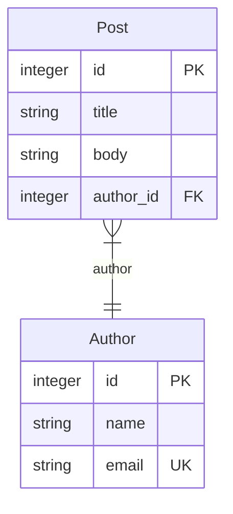
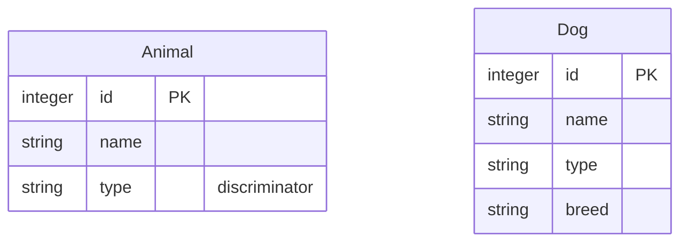

# mikro-orm-markdown

[MikroORM](https://mikro-orm.io) 엔티티에서 **Mermaid ERD + Markdown 문서**를 자동으로 생성합니다.

[](https://badge.fury.io/js/mikro-orm-markdown)
[](https://github.com/iamkanguk97/mikro-orm-markdown/actions)
[](https://opensource.org/licenses/MIT)

[English](./README.md)

> [@samchon](https://github.com/samchon)의 [prisma-markdown](https://github.com/samchon/prisma-markdown)에서 큰 영감을 받았습니다. 좋은 아이디어에 감사드립니다.

## 주요 기능

- **Mermaid ERD 다이어그램** — MikroORM 엔티티 메타데이터에서 생성합니다
- **Markdown 스키마 문서** — 엔티티별 컬럼 테이블, 실제 DB 컬럼명, 키, nullable 여부, 설명, 인덱스, 제약 조건을 포함합니다
- **JSDoc 기반 그룹화 및 노출 제어** — `@namespace`, `@erd`, `@describe`, `@hidden`을 사용합니다
- **실행 중인 DB 연결 불필요** — MikroORM config의 메타데이터 discovery를 사용합니다
- **일반적인 SQL 드라이버 지원** — SQLite, PostgreSQL, MySQL, MariaDB smoke test로 검증합니다

### MikroORM 고유 개념

Prisma 기반 도구로는 표현할 수 없는 MikroORM 고유 개념도 함께 시각화합니다.

- **Embeddable** — 소유 엔티티의 테이블 안에 저장되는 값 객체입니다. `@Embedded` 옵션에 따라 펼쳐진 컬럼(예: `address_street`, `address_city`) 또는 JSON 컬럼으로 저장됩니다. 별도 테이블은 생성되지 않습니다.
- **Single Table Inheritance (STI)** — `Dog`, `Cat` 같은 자식 클래스가 `animals` 테이블 하나를 공유합니다. `type` 같은 discriminator 컬럼으로 어떤 자식 클래스인지 구분합니다.
- **@Formula** — 실제 DB 컬럼 없이 SELECT 시 SQL 식으로 값을 계산하는 가상 컬럼입니다. 예를 들어 `LENGTH(name)`은 DB에 컬럼이 없지만 조회 시 이름의 길이를 반환합니다.

> 이들은 MikroORM의 일급 기능이지만, 모든 프로젝트에서 전부 사용하는 것은 아닙니다. `Embeddable`은 `Address`를 `address_*` 컬럼이나 JSON으로 저장하는 값 객체에 특히 유용하며, 여러 엔티티가 같은 컬럼 묶음을 공유할 때 중복을 줄이는 데에도 사용할 수 있습니다.

## 요구사항

- **Node.js >= 18**
- **MikroORM >= 6** — `@mikro-orm/core`는 peer dependency입니다.
- **MikroORM config 파일** — CLI는 plain MikroORM options object를 default export로 내보내는 파일을 기대합니다.
- **사용할 DB에 맞는 MikroORM 드라이버 패키지** — 예를 들어 `@mikro-orm/postgresql`, `@mikro-orm/mysql`, `@mikro-orm/mariadb`, `@mikro-orm/sqlite`가 있습니다. 실행 중인 DB 연결은 필요 없지만, MikroORM이 메타데이터를 discovery하려면 드라이버는 필요합니다.
- **데코레이터 기반 엔티티** — 엔티티는 `@Entity()` 클래스여야 합니다. `EntitySchema`로 정의한 엔티티는 현재 지원하지 않습니다.
- **해석 가능한 프로퍼티 타입** — 각 엔티티 프로퍼티의 타입은 MikroORM discovery 시점에 알려져야 합니다. `type:` / `entity:` 같은 명시적인 데코레이터 옵션을 사용하거나, `@mikro-orm/reflection`을 설치해 CLI가 TypeScript 소스에 대해 `TsMorphMetadataProvider`를 자동으로 사용하게 하세요.
- **TypeScript config 파일을 위한 `tsx`** — CLI에서 `.ts` MikroORM config를 로드할 때만 필요합니다. `.js` config 파일에는 필요하지 않습니다.

> `@mikro-orm/reflection`을 설치한다면 **`@mikro-orm/core`와 정확히 같은 버전**으로 맞추세요. MikroORM은 공식 `@mikro-orm/*` 패키지들이 하나의 버전을 공유한다고 기대하며, 버전이 다르면 discovery가 실패할 수 있습니다.

## 설치

```bash
npm install -D mikro-orm-markdown
# 또는
pnpm add -D mikro-orm-markdown
```

## 빠른 시작

`package.json`에 스크립트를 추가하고, `--config`에 MikroORM config 파일 경로를 지정하세요:

```json
{
  "scripts": {
    "erd": "mikro-orm-markdown --config ./mikro-orm.config.ts --out ./ERD.md --title 'My Database'"
  }
}
```

- **`.ts` config** — `tsx`를 devDependency로 설치하세요 (`npm install -D tsx`). CLI가 자동으로 로드하며, `preferTs`를 명시하지 않았다면 MikroORM discovery가 `entitiesTs`를 우선 사용하도록 설정합니다.
- **`.js` config** — 추가 패키지 불필요. 직접 작성한 파일이든, 빌드 결과물(예: `./dist/mikro-orm.config.js`)이든 상관없습니다.

이후에는 아래 명령어 하나로 실행합니다:

```bash
npm run erd
```

## CLI 옵션

| 옵션                   | 기본값            | 설명                                                                  |
| ---------------------- | ----------------- | --------------------------------------------------------------------- |
| `-c, --config <path>`  | _(필수)_          | MikroORM 설정 파일 경로                                               |
| `-o, --out <path>`     | `./ERD.md`        | 출력 Markdown 파일 경로                                               |
| `-t, --title <string>` | `Database Schema` | 문서 H1 제목                                                          |
| `-d, --description <string>` | —           | 제목 아래에 표시할 설명 문단 (선택)                                   |
| `--tsconfig <path>`    | —                 | `.ts` config 로드 시 사용할 `tsconfig.json`; 기본값은 config 파일 근처의 가장 가까운 파일 |
| `--src <paths...>`     | —                 | 원본 TypeScript 엔티티 소스 경로/glob; MikroORM이 컴파일된 JavaScript에서 엔티티를 discovery할 때만 필요 |
| `--mermaid-layout <layout>` | —           | Mermaid 레이아웃 엔진 (`dagre\|elk\|elk.stress`). 생략하면 뷰어 기본값 사용. |
| `--mermaid-theme <theme>`   | —           | Mermaid 테마 (`default\|neutral\|dark\|forest\|base`). 생략하면 뷰어 기본값 사용. |

> 설명이 길거나 여러 줄이라면 CLI 대신 [프로그래밍 API](#프로그래밍-api)를 사용하세요 — 쉘 인용 부호 제약 없이 문자열을 그대로 전달할 수 있습니다.

## JSDoc 태그

엔티티 클래스에 JSDoc 태그를 추가해 문서의 섹션과 노출 여부를 제어합니다. JSDoc 주석은 TypeScript 엔티티 소스 파일에서 읽습니다.

> **권장 설정:** `.ts` MikroORM config를 사용하고 `entitiesTs`가 소스 엔티티를 가리키게 하세요. 이 설정에서는 JSDoc을 원본 TypeScript 파일에서 읽으므로 `--src`가 필요하지 않습니다.

```typescript
/**
 * 등록된 사용자가 작성한 블로그 게시글입니다.
 * @namespace Blog
 */
@Entity()
export class Post {
  /** 게시글 제목 */
  @Property()
  title!: string;
}
```

태그가 없는 일반 JSDoc 텍스트는 설명이 됩니다. **클래스** 위 텍스트는 엔티티 설명, **프로퍼티** 위 텍스트는 해당 컬럼 설명이 됩니다. 프로퍼티에 JSDoc이 없으면 `@Property({ comment })` 값(DDL 컬럼 코멘트)을 컬럼 설명으로 대신 사용합니다.

| 태그                | 설명                                  |
| ------------------- | ------------------------------------- |
| `@namespace <Name>` | `Name` 섹션에 포함 (ERD + 본문 표)    |
| `@erd <Name>`       | `Name` 섹션의 ERD 다이어그램에만 포함 |
| `@describe <Name>`  | `Name` 섹션의 본문 표에만 포함        |
| `@hidden`           | 문서 전체에서 제외                    |

태그가 없는 엔티티는 `default` 섹션에 들어갑니다.
하나의 엔티티에 여러 태그를 지정할 수 있습니다.

### 컴파일된 JavaScript 빌드

MikroORM config가 `entities: ['./dist/**/*.js']`처럼 컴파일된 `.js` 파일에서 엔티티를 discovery한다면, 엔티티 구조는 여전히 찾을 수 있지만 JSDoc 주석은 빌드 과정에서 제거되었을 수 있습니다.

이 경우 설명과 `@namespace`, `@hidden` 같은 태그를 해당 `.js` 파일에서 읽을 수 없습니다.

이 경우에만 `--src`를 사용하세요:

```bash
mikro-orm-markdown \
  --config ./dist/mikro-orm.config.js \
  --src "src/**/*.entity.ts"
```

`--src`가 어떤 파일과도 매칭되지 않거나 발견된 엔티티 선언을 빠뜨리면, 불완전한 문서를 조용히 생성하는 대신 실패합니다.

### 관계 카디널리티: `@atLeastOne`

`@atLeastOne`은 TypeScript decorator가 아니라 JSDoc 태그입니다.

컬렉션 관계(`1:N` 또는 `M:N`)는 기본적으로 _0개 이상_으로 렌더링됩니다. 컬렉션 프로퍼티에 `@atLeastOne`를 붙이면 해당 컬렉션 쪽이 _1개 이상_으로 표시됩니다:

```typescript
@Entity()
export class Author {
  /** @atLeastOne */
  @OneToMany(() => Post, (post) => post.author)
  posts = new Collection<Post>(this);
}
```

이렇게 하면 ERD 관계선이 `Post }o--|| Author`에서 `Post }|--|| Author`로 바뀝니다. 이는 문서용 힌트일 뿐이며 — MikroORM에는 스키마 레벨의 최소 개수 개념이 없어 실제로 강제되지는 않습니다. (Mermaid는 0개 이상 / 1개 이상만 구분하므로 그보다 큰 최소값은 표현할 수 없습니다.)

하나의 관계선은 **양 끝이 따로 결정**됩니다:

- **단수(1) 쪽** (`@ManyToOne`, 또는 소유 측 `@OneToOne`) — 스키마에서 자동으로 읽으며 태그가 필요 없습니다: 기본 _정확히 1_ (`||`), `nullable: true`이면 _0 또는 1_ (`o|`).
- **컬렉션(N) 쪽** (`@OneToMany` / `@ManyToMany`) — 기본 _0개 이상_이며, `@atLeastOne`을 붙이면 해당 쪽이 _1개 이상_으로 바뀝니다. Mermaid에서는 컬렉션이 렌더링되는 방향에 따라 `}o` → `}|` 또는 `o{` → `|{`를 사용합니다.

네 가지 조합 (`Post` ↔ `Author`):

```text
Post }o--|| Author   →  작성자 글 0개+,  글은 작성자 정확히 1명   (기본)
Post }o--o| Author   →  작성자 글 0개+,  글은 작성자 0~1명        (nullable: true)
Post }|--|| Author   →  작성자 글 1개+,  글은 작성자 정확히 1명   (@atLeastOne)
Post }|--o| Author   →  작성자 글 1개+,  글은 작성자 0~1명        (둘 다)
```

> **NestJS Swagger Plugin**: `@namespace`, `@erd`, `@describe`, `@hidden`, `@atLeastOne`은 `mikro-orm-markdown`용 커스텀 태그입니다. NestJS Swagger는 이 태그들을 OpenAPI 메타데이터로 사용하지 않습니다. 엔티티 클래스를 DTO로 직접 사용하고 Swagger comment introspection을 켠 경우, 일반 JSDoc 설명은 Swagger 문서에도 표시될 수 있지만 이 커스텀 태그들이 기능적인 충돌을 만들지는 않습니다.

## 출력 예시

다음과 같은 엔티티가 있다고 가정합니다:

```typescript
/**
 * 등록된 사용자가 작성한 블로그 게시글입니다.
 * @namespace Blog
 */
@Entity()
export class Post {
  @PrimaryKey({ type: 'integer' })
  id!: number;

  /** 게시글 제목 */
  @Property({ type: 'string' })
  title!: string;

  @Property({ type: 'text', nullable: true })
  body?: string;

  @ManyToOne({ entity: () => Author })
  author!: Author;
}

/** @namespace Blog */
@Entity()
export class Author {
  @PrimaryKey({ type: 'integer' })
  id!: number;

  @Property({ type: 'string' })
  name!: string;

  @Property({ type: 'string', unique: true })
  email!: string;

  /** @atLeastOne */
  @OneToMany({ entity: () => Post, mappedBy: 'author' })
  posts = new Collection<Post>(this);
}
```

> **예시 참고:** import 문은 간결성을 위해 생략했습니다. 이 예시는 별도 reflection 설정 없이 동작하도록 `type:`을 명시합니다. `@mikro-orm/reflection`이 설치되어 있다면 MikroORM은 `@Property() title!: string` 같은 단순 scalar 타입도 discovery할 수 있습니다.

두 엔티티 모두 `@namespace Blog` 태그를 가지므로 하나의 `## Blog` 섹션에 묶입니다. MikroORM의 기본 naming strategy를 기준으로 생성된 `ERD.md`에는 다음과 같은 ERD가 포함됩니다:



**코드가 출력으로 어떻게 매핑되는가:**

- `@namespace Blog` → 두 엔티티가 `## Blog` 섹션 아래로 묶임
- `@ManyToOne({ entity: () => Author })` → `Post`에서 `Author`로 향하는 관계선과 `author_id FK` 컬럼
- `Author.posts`의 `@atLeastOne` → 컬렉션 쪽이 1개 이상으로 렌더링됨: `Post }|--|| Author`
- `email`의 `unique: true` → `email`이 `UK`(unique key)로 표시됨
- `body`의 `@Property({ nullable: true })` → `Nullable` 칸이 `Y`로 표시됨
- `/** 게시글 제목 */` → `title`의 **Description** 칸을 채움

**키 표기:**

| 표기 | 의미 |
| ---- | ---- |
| `PK` | Primary key |
| `FK` | Foreign key |
| `UK` | Unique key |
| `Nullable`의 `Y` | nullable 컬럼 |

각 엔티티는 컬럼 표로도 표현됩니다. 예를 들어 생성된 `Post` 섹션은 다음과 같습니다:

```markdown
### Post

*Table: `post`*

> 등록된 사용자가 작성한 블로그 게시글입니다.

| Column    | Type    | Key         | Nullable | Description |
| --------- | ------- | ----------- | -------- | ----------- |
| id        | integer | PK          |          |             |
| title     | string  |             |          | 게시글 제목 |
| body      | text    |             | Y        |             |
| author_id | integer | FK (author) |          |             |
```

**생성 결과의 MikroORM 전용 표기 의미:**

| 표기               | 의미                                         |
| ------------------ | -------------------------------------------- |
| `formula: <expr>`  | `@Formula` 계산 컬럼의 Mermaid 주석          |
| `[EmbeddableType]` | `@Embedded` 값 객체에서 flat으로 저장된 컬럼 |
| `discriminator`    | STI 구분자 컬럼                              |

## 참고 사항

### Single Table Inheritance (STI)

STI는 여러 엔티티 클래스가 하나의 DB 테이블을 공유하는 패턴으로, discriminator 컬럼으로 행을 구분합니다.

```typescript
@Entity({ discriminatorColumn: 'type', abstract: true })
export class Animal {
  @PrimaryKey({ type: 'integer' })
  id!: number;

  @Property({ type: 'string' })
  name!: string;
}

@Entity({ discriminatorValue: 'dog' })
export class Dog extends Animal {
  @Property({ type: 'string', nullable: true })
  breed?: string;
}
```

엔티티에 `discriminatorColumn`이 설정되어 있으면 `mikro-orm-markdown`이 자동으로 감지합니다. 서브클래스들은 물리적으로 하나의 테이블을 공유하지만, 다이어그램에서는 **각 클래스가 별도 박스**로 그려져 서브클래스마다 실제 컬럼 구성을 보여줍니다:



루트(`Animal`)는 공유 컬럼만 나열하고 discriminator(`type`)를 표시하며, 각 서브클래스(`Dog`)는 상속 컬럼을 반복한 뒤 자기 컬럼을 추가합니다.

생성된 Markdown 표에도 STI note가 함께 표시됩니다. 루트에는 `STI root — discriminator column: type`, 각 서브클래스에는 `Extends Animal (Single Table Inheritance, discriminator value: dog)` 같은 문구가 추가됩니다.

> **트레이드오프:** STI는 여러 엔티티 타입을 하나의 테이블에 보관할 수 있게 하지만, 쿼리 복잡도를 높이고 nullable 컬럼이 많이 생길 수 있습니다. 하나의 테이블을 공유하는 것이 모델의 의도일 때 사용하세요.

## 문제 해결

**"엔티티가 발견되지 않았습니다" (No entities were discovered)**

MikroORM config가 엔티티를 0개 찾은 경우입니다. 보통 CLI가 config를 로드하는 방식과 엔티티 경로가 맞지 않아 발생합니다.

- `.ts` config를 사용 중이라면(CLI가 `tsx`를 자동으로 로드하고 기본적으로 `preferTs: true`를 적용합니다), `entitiesTs`가 TypeScript 소스 파일을 가리키는지 확인하세요.
- 빌드된 `.js` config를 사용 중이라면, `entities`가 **빌드 결과물**(예: `./dist/**/*.entity.js`)을 가리키고 빌드를 먼저 실행했는지 확인하세요.
- MikroORM은 TypeScript 모드에서는 `entitiesTs`를, 그 외에는 `entities`를 사용합니다. 폴더/파일 기반 discovery를 쓴다면 두 옵션을 모두 지정하세요.

**"Please provide either 'type' or 'entity' attribute"**

MikroORM이 metadata discovery 중 프로퍼티 타입을 해석하지 못한 경우입니다. CLI는 `.ts` config를 `tsx`로 로드하므로, 이 경로에서는 `emitDecoratorMetadata`를 켜는 것만으로는 해결되지 않습니다.

다음 중 하나로 해결하세요:

- `@Property({ type: 'string' })`, `@ManyToOne({ entity: () => User })`처럼 데코레이터 옵션을 명시합니다.
- `@mikro-orm/reflection`을 `@mikro-orm/core`와 정확히 같은 버전으로 설치해 CLI가 `TsMorphMetadataProvider`를 자동으로 사용하게 합니다.

**"Cannot find module '@/...'" (경로 alias)**

config나 엔티티에서 `tsconfig`의 경로 alias(예: `@/entities/user`)를 사용한다면, `tsx`가 올바른 `tsconfig.json`을 찾지 못했을 때 alias를 해석하지 못할 수 있습니다. config 파일을 `tsconfig.json`과 같은 프로젝트 루트에 두면 이 문제를 피할 수 있습니다. config가 다른 위치에 있다면 명시적으로 전달하세요:

```bash
mikro-orm-markdown --config ./packages/api/mikro-orm.config.ts --tsconfig ./packages/api/tsconfig.json
```

**JSDoc 태그가 누락되거나 `@hidden` 엔티티가 노출되는 경우**

엔티티가 컴파일된 JavaScript에서 discovery되고 있을 가능성이 큽니다. 빌드 도구는 `.js` 파일에서 주석을 제거할 수 있으므로, 설명과 `@namespace`, `@hidden`을 읽지 못할 수 있습니다.

가능하면 `.ts` config와 원본 소스 파일을 가리키는 `entitiesTs`를 사용하세요. 반드시 컴파일된 `.js`에서 실행해야 한다면 원본 TypeScript 소스를 함께 전달하세요:

```bash
mikro-orm-markdown --config ./dist/mikro-orm.config.js --src "src/**/*.entity.ts"
```

**Config 파일 요구사항**

config 파일은 일반 설정 객체를 **default export** 해야 합니다.

```typescript
export default defineConfig({ ... }); // ✅
export const config = defineConfig({ ... }); // ❌ named export 미지원
export default async () => defineConfig({ ... }); // ❌ 함수/Promise 미지원
```

config를 비동기적으로 만들어야 한다면, 아래 프로그래밍 API를 사용하세요.

## 고급 사용법

### 프로그래밍 API

커스텀 빌드 스크립트에 통합하거나 출력 결과를 직접 가공해야 할 때 사용합니다:

```typescript
import { writeFile } from 'node:fs/promises';
import { generateMarkdown } from 'mikro-orm-markdown';
import ormConfig from './mikro-orm.config.js';

const markdown = await generateMarkdown({
  orm: ormConfig,
  title: 'My Database',
  description: 'MikroORM metadata에서 생성한 스키마 문서입니다.',
});

await writeFile('./ERD.md', markdown, 'utf-8');
```

프로그래밍 API 옵션:

| 옵션 | 설명 |
| ---- | ---- |
| `orm` | MikroORM options object입니다. 필수입니다. |
| `title` | H1 제목입니다. 기본값은 `Database Schema`입니다. |
| `description` | 제목 아래에 표시할 설명 문단입니다. CLI flag와 달리 쉘 quoting 제약 없이 문자열을 그대로 전달할 수 있습니다. |
| `src` | 원본 TypeScript 엔티티 소스 경로/glob입니다. `orm.entities`가 컴파일된 JavaScript를 discovery할 때만 필요합니다. |
| `onWarn` | 컴파일된 JavaScript에서 JSDoc을 읽지 못하는 상황 같은 non-fatal warning을 받을 callback입니다. |
| `mermaid` | Mermaid 렌더링 옵션입니다. 아래 [Mermaid 렌더링 옵션](#mermaid-렌더링-옵션)을 참고하세요. |

MikroORM config를 비동기적으로 만들어야 한다면 직접 resolve한 뒤 결과 options object를 전달하세요:

```typescript
const ormConfig = await createOrmConfig();
const markdown = await generateMarkdown({ orm: ormConfig });
```

### Mermaid 렌더링 옵션

기본적으로 mikro-orm-markdown은 Mermaid frontmatter config를 출력하지 않습니다. 이렇게 해야 각 Markdown 뷰어의 기본 Mermaid 렌더링 동작이 유지됩니다.

CLI에서 Mermaid 렌더링 옵션을 사용하려면:

```bash
mikro-orm-markdown --config ./mikro-orm.config.ts --mermaid-layout elk
mikro-orm-markdown --config ./mikro-orm.config.ts --mermaid-theme forest
mikro-orm-markdown --config ./mikro-orm.config.ts --mermaid-layout elk --mermaid-theme neutral
```

프로그래밍 API에서는:

```typescript
const markdown = await generateMarkdown({
  orm: ormConfig,
  mermaid: {
    layout: 'elk',
    theme: 'forest',
  },
});
```

layout 또는 theme을 지정하면 각 `erDiagram` 펜스 앞에 YAML frontmatter 블록이 삽입됩니다:

````markdown
```mermaid
---
config:
  layout: elk
  theme: forest
---
erDiagram
  ...
```
````

**사용 가능한 layout 값:**

| 값 | 설명 |
| -- | ---- |
| `dagre` | Mermaid 기본 레이아웃 엔진. |
| `elk` | 대체 레이아웃 엔진. 엔티티가 많거나 관계선이 복잡한 ERD에서 선 라우팅을 개선할 수 있습니다. |
| `elk.stress` | ELK stress 레이아웃 변형. Mermaid 버전과 뷰어에 따라 지원 여부가 다릅니다. |

**사용 가능한 theme 값:** `default`, `neutral`, `dark`, `forest`, `base`.

> `elk`와 theme 지원 여부는 뷰어마다 다릅니다. `--mermaid-layout`이나 `--mermaid-theme`을 지정하지 않으면 frontmatter는 출력되지 않습니다.

## 라이선스

MIT
