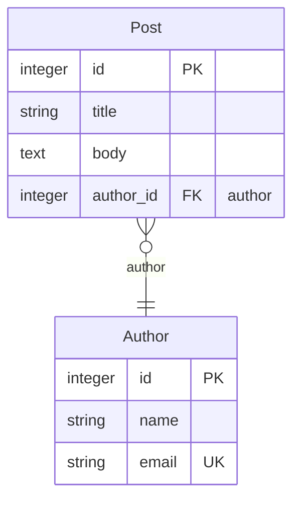

# mikro-orm-markdown

[MikroORM](https://mikro-orm.io) 엔티티에서 **Mermaid ERD + Markdown 문서**를 자동으로 생성합니다.

[](https://badge.fury.io/js/mikro-orm-markdown)
[](https://github.com/iamkanguk97/mikro-orm-markdown/actions)
[](https://opensource.org/licenses/MIT)

[English](./README.md)

> [@samchon](https://github.com/samchon)의 [prisma-markdown](https://github.com/samchon/prisma-markdown)에서 큰 영감을 받았습니다. 좋은 아이디어에 감사드립니다.

MikroORM에서도 동일한 ERD + Markdown 경험을 제공하며, Prisma로는 표현할 수 없는 MikroORM 고유 개념도 함께 시각화합니다.

- **Embeddable** — 별도 테이블 없이 소유 엔티티의 테이블 안에 컬럼을 펼쳐서 저장하는 값 객체입니다. 예를 들어 `Address` 값 객체는 `address_street`, `address_city` 등의 컬럼으로 저장됩니다. DDD의 Value Object와 같은 개념입니다.
- **Single Table Inheritance (STI)** — `Dog`, `Cat` 같은 자식 클래스가 `animals` 테이블 하나를 공유합니다. `type` 같은 discriminator 컬럼으로 어떤 자식 클래스인지 구분합니다.
- **@Formula** — 실제 DB 컬럼 없이 SELECT 시 SQL 식으로 값을 계산하는 가상 컬럼입니다. 예를 들어 `LENGTH(name)`은 DB에 컬럼이 없지만 조회 시 이름의 길이를 반환합니다.
- NamingStrategy가 적용된 **실제 DB 컬럼명**
- **인덱스 및 제약 조건**

DB에 연결하지 않으므로 MikroORM이 지원하는 모든 DB(PostgreSQL, MySQL, SQLite, MSSQL 등)에서 동작합니다.

## 요구사항

- Node.js >= 18
- `@mikro-orm/core` >= 6 (peer dependency)
- TypeScript 설정 파일 사용 시 `tsx` 또는 `ts-node` 필요

## 설치

```bash
npm install -D mikro-orm-markdown
# 또는
pnpm add -D mikro-orm-markdown
```

## 빠른 시작

`package.json`에 스크립트를 한 번 등록합니다:

```json
{
  "scripts": {
    "erd": "mikro-orm-markdown --config ./mikro-orm.config.js --out ./ERD.md --title 'My Database' --src 'src/entities/**/*.ts'"
  }
}
```

TypeScript 설정 파일을 사용한다면 `tsx`를 앞에 붙입니다:

```json
{
  "scripts": {
    "erd": "tsx ./node_modules/.bin/mikro-orm-markdown --config ./mikro-orm.config.ts --out ./ERD.md --title 'My Database' --src 'src/entities/**/*.ts'"
  }
}
```

이후에는 아래 명령어 하나로 실행합니다:

```bash
npm run erd
```

## CLI 옵션

| 옵션                   | 기본값            | 설명                                                                  |
| ---------------------- | ----------------- | --------------------------------------------------------------------- |
| `-c, --config <path>`  | _(필수)_          | MikroORM 설정 파일 경로                                               |
| `-o, --out <path>`     | `./ERD.md`        | 출력 Markdown 파일 경로                                               |
| `-t, --title <string>` | `Database Schema` | 문서 H1 제목                                                          |
| `-s, --src <glob>`     | —                 | 엔티티 소스 파일 glob 패턴 (반복 가능). JSDoc 태그 추출에 사용됩니다. |

## JSDoc 태그

엔티티 클래스에 JSDoc 태그를 추가해 문서의 섹션과 노출 여부를 제어합니다.

```typescript
/**
 * 등록된 사용자가 작성한 블로그 게시글입니다.
 * @namespace Blog
 */
@Entity()
export class Post {
  /** 게시글 제목 */
  @Property()
  title!: string;
}
```

| 태그                | 설명                                  |
| ------------------- | ------------------------------------- |
| `@namespace <Name>` | `Name` 섹션에 포함 (ERD + 본문 표)    |
| `@erd <Name>`       | `Name` 섹션의 ERD 다이어그램에만 포함 |
| `@describe <Name>`  | `Name` 섹션의 본문 표에만 포함        |
| `@hidden`           | 문서 전체에서 제외                    |

태그가 없는 엔티티는 `default` 섹션에 들어갑니다.
하나의 엔티티에 여러 태그를 지정할 수 있습니다.

> **NestJS Swagger Plugin**: `@namespace`, `@erd`, `@describe`, `@hidden`은 Swagger가 인식하지 못하는 커스텀 태그이므로 무시됩니다. 엔티티 클래스를 DTO로 직접 사용하는 구조라면 JSDoc 설명이 Swagger 문서에도 함께 표시될 수 있지만, 기능적인 충돌은 없습니다.

## 출력 예시

네임스페이스마다 섹션이 생성되고, 각 섹션에는 Mermaid ERD 블록과 엔티티별 컬럼 표가 포함됩니다.

````markdown
## Blog



### Post

> 등록된 사용자가 작성한 블로그 게시글입니다.

| Column    | Type    | Key         | Nullable | Description |
| --------- | ------- | ----------- | -------- | ----------- |
| id        | integer | PK          |          |             |
| title     | string  |             |          | 게시글 제목 |
| body      | text    |             | Y        |             |
| author_id | integer | FK (author) |          |             |
````

**Key 컬럼 주석 의미:**

| 표기               | 의미                                         |
| ------------------ | -------------------------------------------- |
| `formula: <expr>`  | `@Formula` 계산 컬럼 — 실제 DB 컬럼 없음     |
| `[EmbeddableType]` | `@Embedded` 값 객체에서 flat으로 저장된 컬럼 |
| `discriminator`    | STI 구분자 컬럼                              |

## 참고 사항

### Single Table Inheritance (STI)

STI는 여러 엔티티 클래스가 하나의 DB 테이블을 공유하는 패턴으로, discriminator 컬럼으로 행을 구분합니다.

```typescript
@Entity({ discriminatorColumn: 'type', abstract: true })
export class Animal {
  @PrimaryKey()
  id!: number;

  @Property()
  name!: string;
}

@Entity({ discriminatorValue: 'dog' })
export class Dog extends Animal {
  @Property({ nullable: true })
  breed?: string;
}
```

엔티티에 `discriminatorColumn`이 설정되어 있으면 `mikro-orm-markdown`이 자동으로 감지해 출력에 discriminator 컬럼을 표시합니다.

> **대부분의 프로젝트에는 권장하지 않습니다.** STI는 테이블 단순화 대신 쿼리 복잡도 증가와 nullable 컬럼 낭비를 초래합니다. 여러 엔티티 타입을 하나의 테이블에 저장해야 하는 명확한 이유가 있을 때만 사용하세요.

## 고급 사용법

### 프로그래밍 API

커스텀 빌드 스크립트에 통합하거나 출력 결과를 직접 가공해야 할 때 사용합니다:

```typescript
import { generateMarkdown } from 'mikro-orm-markdown';
import ormConfig from './mikro-orm.config.js';

const markdown = await generateMarkdown({
  orm: ormConfig,
  title: 'My Database',
  src: ['src/entities/**/*.ts'],
});

await fs.writeFile('./ERD.md', markdown, 'utf-8');
```

## 라이선스

MIT
