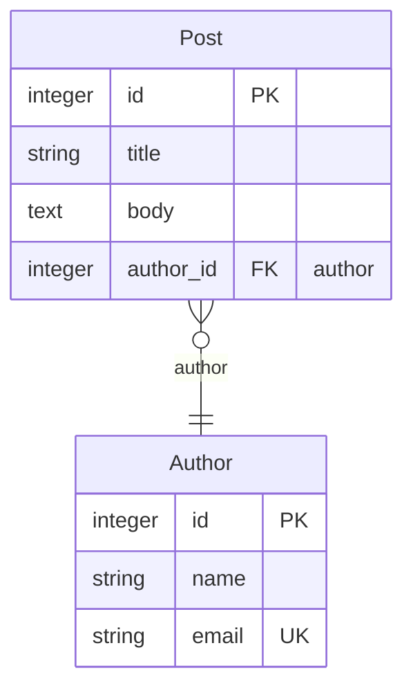

# mikro-orm-markdown

Generate **Mermaid ERD + Markdown documentation** from your [MikroORM](https://mikro-orm.io) entities.

[](https://badge.fury.io/js/mikro-orm-markdown)
[](https://github.com/iamkanguk97/mikro-orm-markdown/actions)
[](https://opensource.org/licenses/MIT)

[한국어 문서](./README.ko.md)

> Heavily inspired by [prisma-markdown](https://github.com/samchon/prisma-markdown) by [@samchon](https://github.com/samchon). Thank you for the great idea.

This tool brings the same ERD + Markdown experience to MikroORM, with additional visualization for MikroORM-specific concepts that cannot be expressed in Prisma:

- **Embeddable** — a value object whose fields are stored as flat columns inside the owning entity's table (e.g. `address_street`, `address_city`). No separate table is created.
- **Single Table Inheritance (STI)** — subclasses like `Dog` and `Cat` share one `animals` table. A discriminator column (e.g. `type`) distinguishes which subclass each row belongs to.
- **@Formula** — a virtual column with no physical DB column. Its value is computed by a SQL expression at SELECT time (e.g. `LENGTH(name)`).
- **Actual DB column names** derived from your NamingStrategy
- **Indexes and constraints**

Works with all databases supported by MikroORM (PostgreSQL, MySQL, SQLite, MSSQL, and more) — no database connection required.

## Requirements

- Node.js >= 18
- `@mikro-orm/core` >= 6 (peer dependency)
- TypeScript config files require `tsx` or `ts-node`

## Installation

```bash
npm install -D mikro-orm-markdown
# or
pnpm add -D mikro-orm-markdown
```

## Quick Start

Add a script to your `package.json`:

```json
{
  "scripts": {
    "erd": "mikro-orm-markdown --config ./mikro-orm.config.js --out ./ERD.md --title 'My Database' --src 'src/entities/**/*.ts'"
  }
}
```

For TypeScript config files, use `tsx`:

```json
{
  "scripts": {
    "erd": "tsx ./node_modules/.bin/mikro-orm-markdown --config ./mikro-orm.config.ts --out ./ERD.md --title 'My Database' --src 'src/entities/**/*.ts'"
  }
}
```

Then run:

```bash
npm run erd
```

## CLI Options

| Option | Default | Description |
|--------|---------|-------------|
| `-c, --config <path>` | *(required)* | Path to MikroORM config file |
| `-o, --out <path>` | `./ERD.md` | Output Markdown file path |
| `-t, --title <string>` | `Database Schema` | H1 heading of the generated document |
| `-s, --src <glob>` | — | Glob pattern for entity source files (repeatable). Enables JSDoc tag extraction. |

## JSDoc Tags

Annotate your entity classes to control sections and visibility in the generated document.

```typescript
/**
 * Blog post authored by a registered user.
 * @namespace Blog
 */
@Entity()
export class Post {
  /** Post title */
  @Property()
  title!: string;
}
```

| Tag | Description |
|-----|-------------|
| `@namespace <Name>` | Include entity in section `Name` (ERD + text table) |
| `@erd <Name>` | Include in section `Name`'s ERD diagram only |
| `@describe <Name>` | Include in section `Name`'s text table only |
| `@hidden` | Exclude entity from the entire document |

Entities with no tag are placed in the `default` section.
An entity can carry multiple tags to appear in more than one section.

> **NestJS Swagger Plugin**: `@namespace`, `@erd`, `@describe`, and `@hidden` are custom tags that Swagger does not recognize and will ignore. If you use your entity classes directly as DTOs, the JSDoc description may appear in your Swagger docs as well — but there is no functional conflict.

## Output Example

Each namespace becomes a section with a Mermaid ERD block followed by per-entity column tables.

````markdown
## Blog



### Post

> Blog post authored by a registered user.

| Column | Type | Key | Description |
|--------|------|-----|-------------|
| id | integer | PK | |
| title | string | | Post title |
| body | text | | *(nullable)* |
| author_id | integer | FK (author) | |
````

MikroORM-specific annotations in the **Key** column:

| Annotation | Meaning |
|------------|---------|
| `formula: <expr>` | `@Formula` computed column — no physical DB column |
| `[EmbeddableType]` | Flat column inlined from an `@Embedded` value object |
| `discriminator` | STI discriminator column |

## Advanced Usage

### Programmatic API

If you need to integrate ERD generation into a custom build script or process the output programmatically:

```typescript
import { generateMarkdown } from 'mikro-orm-markdown';
import ormConfig from './mikro-orm.config.js';

const markdown = await generateMarkdown({
  orm: ormConfig,
  title: 'My Database',
  src: ['src/entities/**/*.ts'],
});

await fs.writeFile('./ERD.md', markdown, 'utf-8');
```

## License

MIT
