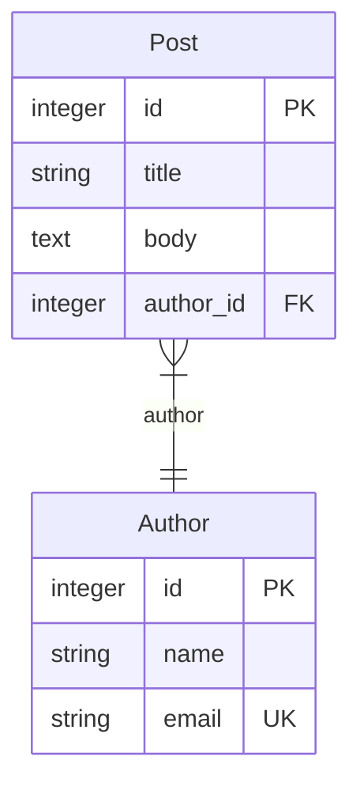
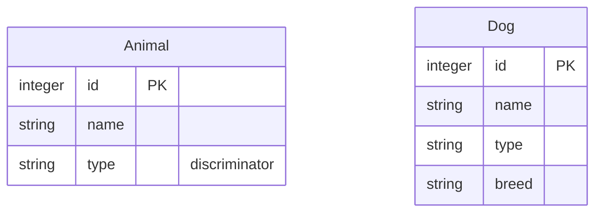

# mikro-orm-markdown

Generate **Mermaid ERD + Markdown documentation** from your [MikroORM](https://mikro-orm.io) entities.

[](https://badge.fury.io/js/mikro-orm-markdown)
[](https://github.com/iamkanguk97/mikro-orm-markdown/actions)
[](https://opensource.org/licenses/MIT)

[한국어 문서](./README.ko.md)

> Heavily inspired by [prisma-markdown](https://github.com/samchon/prisma-markdown) by [@samchon](https://github.com/samchon). Thank you for the great idea.

## Features

- **Mermaid ERD diagrams** generated from MikroORM entity metadata
- **Markdown schema documentation** with per-entity column tables, actual DB column names, keys, nullability, descriptions, indexes, and constraints
- **JSDoc-driven grouping and visibility** via `@namespace`, `@erd`, `@describe`, and `@hidden`
- **No live database connection required** — uses MikroORM metadata discovery from your config
- **Works across common SQL drivers** — covered by smoke tests for SQLite, PostgreSQL, MySQL, and MariaDB

### MikroORM-specific concepts

Beyond what Prisma-based tools can express, `mikro-orm-markdown` also visualizes concepts unique to MikroORM:

- **Embeddable** — a value object stored inside the owning entity's table, either as flattened columns (e.g. `address_street`, `address_city`) or as a JSON column depending on the `@Embedded` options. No separate table is created.
- **Single Table Inheritance (STI)** — subclasses like `Dog` and `Cat` share one `animals` table. A discriminator column (e.g. `type`) distinguishes which subclass each row belongs to.
- **@Formula** — a virtual column with no physical DB column. Its value is computed by a SQL expression at SELECT time (e.g. `LENGTH(name)`).

> These are first-class MikroORM features, though not every project uses all of them. `Embeddable` is especially useful for value objects, such as an `Address` stored as `address_*` columns or as JSON, and can also reduce duplication when several entities share the same column group.

## Requirements

- **Node.js >= 18**
- **MikroORM >= 6** — `@mikro-orm/core` is a peer dependency.
- **A MikroORM config file** — the CLI expects a default export of a plain MikroORM options object.
- **The matching MikroORM driver package** — for example `@mikro-orm/postgresql`, `@mikro-orm/mysql`, `@mikro-orm/mariadb`, or `@mikro-orm/sqlite`. A live database connection is not required, but MikroORM still needs the driver to discover metadata.
- **Decorator-based entities** — entities must be `@Entity()` classes. `EntitySchema`-defined entities are not currently supported.
- **Resolvable property types** — each entity property's type must be known during MikroORM discovery. Use explicit decorator options such as `type:` / `entity:`, or install `@mikro-orm/reflection` so the CLI can auto-use `TsMorphMetadataProvider` for TypeScript sources.
- **`tsx` for TypeScript config files** — required only when loading a `.ts` MikroORM config through the CLI. `.js` config files do not need it.

> If you install `@mikro-orm/reflection`, keep it at the **same exact version** as `@mikro-orm/core`. MikroORM expects official `@mikro-orm/*` packages to share one version, and mismatches can fail discovery.

## Installation

```bash
npm install -D mikro-orm-markdown
# or
pnpm add -D mikro-orm-markdown
```

## Quick Start

Add a script to your `package.json`, pointing `--config` at your MikroORM config file:

```json
{
  "scripts": {
    "erd": "mikro-orm-markdown --config ./mikro-orm.config.ts --out ./ERD.md --title 'My Database'"
  }
}
```

- **`.ts` config** — install `tsx` as a dev dependency (`npm install -D tsx`); the CLI loads it automatically and defaults MikroORM discovery to `entitiesTs` unless you explicitly set `preferTs`.
- **`.js` config** — no extra packages needed. Can be hand-written, or your own build output (e.g. `./dist/mikro-orm.config.js`).

Then run:

```bash
npm run erd
```

## CLI Options

| Option                 | Default           | Description                                                                      |
| ---------------------- | ----------------- | -------------------------------------------------------------------------------- |
| `-c, --config <path>`  | _(required)_      | Path to MikroORM config file                                                     |
| `-o, --out <path>`     | `./ERD.md`        | Output Markdown file path                                                        |
| `-t, --title <string>` | `Database Schema` | H1 heading of the generated document                                             |
| `-d, --description <string>` | —           | Optional description paragraph shown below the title                            |
| `--tsconfig <path>`    | —                 | `tsconfig.json` used when loading a `.ts` config; defaults to the nearest one beside the config file |
| `--src <paths...>`     | —                 | Original TypeScript entity source paths/globs; only needed when MikroORM discovers entities from compiled JavaScript |

> For a long or multiline description, use the [programmatic API](#programmatic-api) instead — it accepts any string directly, without shell quoting limits.

## JSDoc Tags

Annotate your entity classes to control sections and visibility in the generated document. JSDoc comments are read from TypeScript entity source files.

> **Recommended setup:** Use a `.ts` MikroORM config with `entitiesTs` pointing at your source entities. In this setup, JSDoc is read from the original TypeScript files and `--src` is not needed.

```typescript
/**
 * Blog post authored by a registered user.
 * @namespace Blog
 */
@Entity()
export class Post {
  /** Post title */
  @Property()
  title!: string;
}
```

Plain JSDoc text (no tag) becomes a description: text above a **class** describes the entity, and text above a **property** describes its column. When a property has no JSDoc, its `@Property({ comment })` value (the DDL column comment) is used as the column description instead.

| Tag                 | Description                                         |
| ------------------- | --------------------------------------------------- |
| `@namespace <Name>` | Include entity in section `Name` (ERD + text table) |
| `@erd <Name>`       | Include in section `Name`'s ERD diagram only        |
| `@describe <Name>`  | Include in section `Name`'s text table only         |
| `@hidden`           | Exclude entity from the entire document             |

Entities with no tag are placed in the `default` section.
An entity can carry multiple tags to appear in more than one section.

### Compiled JavaScript Builds

If your MikroORM config discovers entities from compiled `.js` files, such as `entities: ['./dist/**/*.js']`, entity structure can still be discovered, but JSDoc comments may have been stripped.

That means descriptions and tags such as `@namespace` and `@hidden` cannot be read from those `.js` files.

Use `--src` only in this case:

```bash
mikro-orm-markdown \
  --config ./dist/mikro-orm.config.js \
  --src "src/**/*.entity.ts"
```

If `--src` matches no files or omits discovered entity declarations, generation fails instead of silently producing incomplete documentation.

### Relation Cardinality: `@atLeastOne`

`@atLeastOne` is a JSDoc tag, not a TypeScript decorator.

A collection relation (`1:N` or `M:N`) renders as _zero-or-more_ by default. Tag the collection property with `@atLeastOne` to render that collection side as _one-or-more_ instead:

```typescript
@Entity()
export class Author {
  /** @atLeastOne */
  @OneToMany(() => Post, (post) => post.author)
  posts = new Collection<Post>(this);
}
```

This turns the ERD edge `Post }o--|| Author` into `Post }|--|| Author`. It is a documentation hint only — MikroORM has no schema-level minimum, and the count is not enforced. (Mermaid distinguishes only zero-or-more vs. one-or-more, so no larger minimum can be expressed.)

A relation edge has **two ends, set independently**:

- **Singular side** (`@ManyToOne`, or the owning `@OneToOne`) — read from your schema automatically, no tag needed: _exactly-one_ (`||`) by default, or _zero-or-one_ (`o|`) when `nullable: true`.
- **Collection side** (`@OneToMany` / `@ManyToMany`) — _zero-or-more_ by default; `@atLeastOne` raises that side to _one-or-more_. Mermaid uses `}o` → `}|` or `o{` → `|{` depending on which side of the edge the collection is rendered on.

The four combinations (`Post` ↔ `Author`):

```text
Post }o--|| Author   →  author 0+ posts,  post exactly 1 author   (default)
Post }o--o| Author   →  author 0+ posts,  post 0-or-1 author      (nullable: true)
Post }|--|| Author   →  author 1+ posts,  post exactly 1 author   (@atLeastOne)
Post }|--o| Author   →  author 1+ posts,  post 0-or-1 author      (both)
```

> **NestJS Swagger Plugin**: `@namespace`, `@erd`, `@describe`, `@hidden`, and `@atLeastOne` are custom tags for `mikro-orm-markdown`. NestJS Swagger does not use these tags for OpenAPI metadata. If you use entity classes directly as DTOs and enable Swagger comment introspection, the plain JSDoc description may also appear in your Swagger docs, but these custom tags do not create a functional conflict.

## Output Example

Given these entities:

```typescript
/**
 * Blog post authored by a registered user.
 * @namespace Blog
 */
@Entity()
export class Post {
  @PrimaryKey({ type: 'integer' })
  id!: number;

  /** Post title */
  @Property({ type: 'string' })
  title!: string;

  @Property({ type: 'text', nullable: true })
  body?: string;

  @ManyToOne({ entity: () => Author })
  author!: Author;
}

/** @namespace Blog */
@Entity()
export class Author {
  @PrimaryKey({ type: 'integer' })
  id!: number;

  @Property({ type: 'string' })
  name!: string;

  @Property({ type: 'string', unique: true })
  email!: string;

  /** @atLeastOne */
  @OneToMany({ entity: () => Post, mappedBy: 'author' })
  posts = new Collection<Post>(this);
}
```

> **Example notes:** Imports are omitted for brevity. This example uses explicit `type:` options so it works without extra reflection setup. If `@mikro-orm/reflection` is installed, MikroORM can also discover simple scalar types from `@Property() title!: string`.

Both entities share the `@namespace Blog` tag, so they land in one `## Blog` section. With MikroORM's default naming strategy, the generated `ERD.md` contains an ERD like this:



**How the code maps to the output:**

- `@namespace Blog` → both entities are grouped under the `## Blog` section
- `@ManyToOne({ entity: () => Author })` → the `Post` to `Author` relation line and the `author_id FK` column
- `@atLeastOne` on `Author.posts` → the collection side is rendered as one-or-more: `Post }|--|| Author`
- `unique: true` on `email` → `email` is marked `UK` (unique key)
- `@Property({ nullable: true })` on `body` → the `Nullable` cell is marked `Y`
- `/** Post title */` → fills the **Description** cell for `title`

**Key legend:**

| Marker | Meaning |
| ------ | ------- |
| `PK`   | Primary key |
| `FK`   | Foreign key |
| `UK`   | Unique key |
| `Y` in `Nullable` | Nullable column |

Each entity also gets a column table. For example, the generated `Post` section looks like this:

```markdown
### Post

*Table: `post`*

> Blog post authored by a registered user.

| Column    | Type    | Key         | Nullable | Description |
| --------- | ------- | ----------- | -------- | ----------- |
| id        | integer | PK          |          |             |
| title     | string  |             |          | Post title  |
| body      | text    |             | Y        |             |
| author_id | integer | FK (author) |          |             |
```

MikroORM-specific annotations in the generated output:

| Annotation         | Meaning                                              |
| ------------------ | ---------------------------------------------------- |
| `formula: <expr>`  | Mermaid comment for an `@Formula` computed column    |
| `[EmbeddableType]` | Flat column inlined from an `@Embedded` value object |
| `discriminator`    | STI discriminator column                             |

## Notes

### Single Table Inheritance (STI)

STI is a pattern where multiple entity classes share a single database table, using a discriminator column to tell rows apart.

```typescript
@Entity({ discriminatorColumn: 'type', abstract: true })
export class Animal {
  @PrimaryKey({ type: 'integer' })
  id!: number;

  @Property({ type: 'string' })
  name!: string;
}

@Entity({ discriminatorValue: 'dog' })
export class Dog extends Animal {
  @Property({ type: 'string', nullable: true })
  breed?: string;
}
```

When an entity uses `discriminatorColumn`, `mikro-orm-markdown` detects it automatically. Even though the subclasses share one physical table, each class is drawn as its **own box** so the diagram shows the effective shape of every subclass:



The root (`Animal`) lists only the shared columns and marks the discriminator (`type`); each subclass (`Dog`) repeats the inherited columns and adds its own.

The generated Markdown table also includes STI notes, such as `STI root — discriminator column: type` on the root and `Extends Animal (Single Table Inheritance, discriminator value: dog)` on each subclass.

> **Trade-off:** STI keeps several entity types in one table, but can increase query complexity and produce sparse nullable columns. Use it when sharing one table is an intentional part of your model.

## Troubleshooting

**"No entities were discovered"**

Your MikroORM config found zero entities. This usually means the entity path doesn't match how the CLI is loading your config:

- If you're using a `.ts` config (the CLI loads `tsx` automatically and defaults to `preferTs: true`), make sure `entitiesTs` points to your TypeScript source files.
- If you're using a compiled `.js` config, make sure `entities` points to the **built output** (e.g. `./dist/**/*.entity.js`) and that you've run your build first.
- MikroORM uses `entitiesTs` when running in TypeScript mode and `entities` otherwise — if you use folder/file-based discovery, specify both.

**"Please provide either 'type' or 'entity' attribute"**

MikroORM could not resolve a property type during metadata discovery. The CLI loads `.ts` configs through `tsx`, so enabling `emitDecoratorMetadata` alone will not fix this path.

Fix it in one of these ways:

- Add explicit decorator options, such as `@Property({ type: 'string' })` or `@ManyToOne({ entity: () => User })`.
- Install `@mikro-orm/reflection` at the same exact version as `@mikro-orm/core` so the CLI can auto-use `TsMorphMetadataProvider`.

**"Cannot find module '@/...'" (path aliases)**

If your config or entities use `tsconfig` path aliases (e.g. `@/entities/user`), `tsx` may fail to resolve them when it cannot find the right `tsconfig.json`. Keeping the config file at your project root (next to `tsconfig.json`) avoids this. If your config lives elsewhere, pass the right file explicitly:

```bash
mikro-orm-markdown --config ./packages/api/mikro-orm.config.ts --tsconfig ./packages/api/tsconfig.json
```

**JSDoc tags are missing, or `@hidden` entities appear**

Your entities were probably discovered from compiled JavaScript. Build tools may strip comments from `.js` files, so descriptions, `@namespace`, and `@hidden` cannot be read there.

Prefer a `.ts` config with `entitiesTs` pointing at your source files. If you must run from compiled `.js`, pass the original TypeScript sources:

```bash
mikro-orm-markdown --config ./dist/mikro-orm.config.js --src "src/**/*.entity.ts"
```

**Config file requirements**

The config file must have a **default export** of a plain configuration object:

```typescript
export default defineConfig({ ... }); // ✅
export const config = defineConfig({ ... }); // ❌ named export not supported
export default async () => defineConfig({ ... }); // ❌ functions/Promises not supported
```

If you need to resolve the config asynchronously, use the programmatic API instead (see below).

## Advanced Usage

### Programmatic API

If you need to integrate ERD generation into a custom build script or process the output programmatically:

```typescript
import { writeFile } from 'node:fs/promises';
import { generateMarkdown } from 'mikro-orm-markdown';
import ormConfig from './mikro-orm.config.js';

const markdown = await generateMarkdown({
  orm: ormConfig,
  title: 'My Database',
  description: 'Schema documentation generated from MikroORM metadata.',
});

await writeFile('./ERD.md', markdown, 'utf-8');
```

Programmatic options:

| Option | Description |
| ------ | ----------- |
| `orm` | MikroORM options object. Required. |
| `title` | H1 title. Defaults to `Database Schema`. |
| `description` | Optional paragraph below the title. Unlike the CLI flag, this can be any string without shell quoting concerns. |
| `src` | Original TypeScript entity source paths/globs. Only needed when `orm.entities` discovers compiled JavaScript. |
| `onWarn` | Callback for non-fatal warnings, such as compiled JavaScript JSDoc loss. |

If your MikroORM config is asynchronous, resolve it yourself and pass the resulting options object:

```typescript
const ormConfig = await createOrmConfig();
const markdown = await generateMarkdown({ orm: ormConfig });
```

## License

MIT
