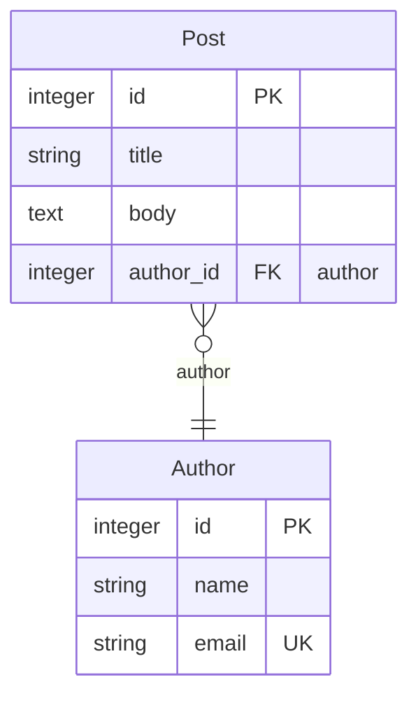
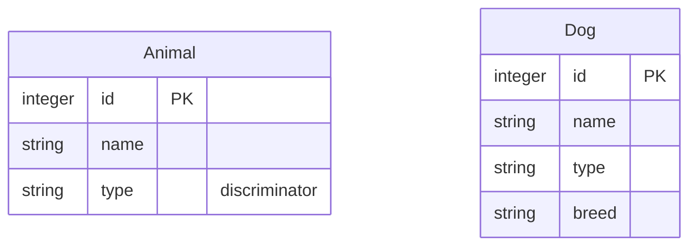

# mikro-orm-markdown

Generate **Mermaid ERD + Markdown documentation** from your [MikroORM](https://mikro-orm.io) entities.

[](https://badge.fury.io/js/mikro-orm-markdown)
[](https://github.com/iamkanguk97/mikro-orm-markdown/actions)
[](https://opensource.org/licenses/MIT)

[한국어 문서](./README.ko.md)

> Heavily inspired by [prisma-markdown](https://github.com/samchon/prisma-markdown) by [@samchon](https://github.com/samchon). Thank you for the great idea.

## Features

- **Mermaid ERD diagrams**, grouped into sections you control with JSDoc tags
  - Per-entity column tables — types, keys, nullability, and descriptions
  - Actual DB column names derived from your NamingStrategy
  - Indexes and constraints
- **No live database connection required** — reads entity metadata from your MikroORM config
- **Driver-agnostic** — works from MikroORM metadata, so any SQL driver (PostgreSQL, MySQL/MariaDB, SQLite, MSSQL) should work. Currently exercised against SQLite in the test suite; other drivers are expected to work but not yet covered by automated tests.

### MikroORM-specific concepts

Beyond what Prisma-based tools can express, `mikro-orm-markdown` also visualizes concepts unique to MikroORM:

- **Embeddable** — a value object whose fields are stored as flat columns inside the owning entity's table (e.g. `address_street`, `address_city`). No separate table is created.
- **Single Table Inheritance (STI)** — subclasses like `Dog` and `Cat` share one `animals` table. A discriminator column (e.g. `type`) distinguishes which subclass each row belongs to.
- **@Formula** — a virtual column with no physical DB column. Its value is computed by a SQL expression at SELECT time (e.g. `LENGTH(name)`).

> These features are fully supported by MikroORM but are less commonly used in practice. Embeddable is most intuitive for value objects (e.g. an `Address` grouped into `address_*` columns) — common when MikroORM entities double as domain objects, but also useful purely as an ORM tool to deduplicate repeated column groups or store a value in a JSON column.

## Requirements

- Node.js >= 18
- `@mikro-orm/core` >= 6 (peer dependency)
- A MikroORM config file with the matching database driver package installed
- Decorator-based entities (`@Entity()`) — `EntitySchema`-defined entities are not currently supported

## Installation

```bash
npm install -D mikro-orm-markdown
# or
pnpm add -D mikro-orm-markdown
```

## Quick Start

Add a script to your `package.json`, pointing `--config` at your MikroORM config file:

```json
{
  "scripts": {
    "erd": "mikro-orm-markdown --config ./mikro-orm.config.ts --out ./ERD.md --title 'My Database'"
  }
}
```

- **`.ts` config** — install `tsx` as a dev dependency (`npm install -D tsx`); the CLI loads it automatically and defaults MikroORM discovery to `entitiesTs` unless you explicitly set `preferTs`.
- **`.js` config** — no extra packages needed. Can be hand-written, or your own build output (e.g. `./dist/mikro-orm.config.js`).

Then run:

```bash
npm run erd
```

## CLI Options

| Option                 | Default           | Description                                                                      |
| ---------------------- | ----------------- | -------------------------------------------------------------------------------- |
| `-c, --config <path>`  | _(required)_      | Path to MikroORM config file                                                     |
| `-o, --out <path>`     | `./ERD.md`        | Output Markdown file path                                                        |
| `-t, --title <string>` | `Database Schema` | H1 heading of the generated document                                             |
| `-d, --description <string>` | —           | Optional description paragraph shown below the title                            |
| `--tsconfig <path>`    | —                 | `tsconfig.json` used when loading a `.ts` config                                |
| `--src <paths...>`     | —                 | TypeScript source globs for JSDoc when entities run from compiled JavaScript    |

> For a long or multiline description, use the [programmatic API](#programmatic-api) instead — it accepts any string directly, without shell quoting limits.

## JSDoc Tags

Annotate your entity classes to control sections and visibility in the generated document. JSDoc comments are read directly from your decorator-based entity source files — no extra configuration needed.

```typescript
/**
 * Blog post authored by a registered user.
 * @namespace Blog
 */
@Entity()
export class Post {
  /** Post title */
  @Property()
  title!: string;
}
```

Plain JSDoc text (no tag) becomes a description: text above a **class** describes the entity, and text above a **property** describes its column. When a property has no JSDoc, its `@Property({ comment })` value (the DDL column comment) is used as the column description instead.

> **Running from compiled JavaScript?** Build tools strip comments, so JSDoc descriptions and `@namespace`/`@hidden` tags cannot be read from `.js` entities — hidden entities may even be exposed. If your `entities` point at compiled output (e.g. `./dist/**/*.js`), pass `--src "<glob to your .ts sources>"` (or the `src` option in the programmatic API) so JSDoc is read from the original TypeScript. The CLI prints a warning when it detects this situation. If the explicit `--src` paths match no files or omit discovered entity declarations, generation fails so the mistake is visible.

| Tag                 | Description                                         |
| ------------------- | --------------------------------------------------- |
| `@namespace <Name>` | Include entity in section `Name` (ERD + text table) |
| `@erd <Name>`       | Include in section `Name`'s ERD diagram only        |
| `@describe <Name>`  | Include in section `Name`'s text table only         |
| `@hidden`           | Exclude entity from the entire document             |

Entities with no tag are placed in the `default` section.
An entity can carry multiple tags to appear in more than one section.

### Relation cardinality: `@atLeastOne`

A collection relation (`1:N` or `M:N`) renders as _zero-or-more_ by default. Tag the collection property with `@atLeastOne` to render it as _one-or-more_ instead:

```typescript
@Entity()
export class Author {
  /** @atLeastOne */
  @OneToMany(() => Post, (post) => post.author)
  posts = new Collection<Post>(this);
}
```

This turns the ERD edge `Post }o--|| Author` into `Post }|--|| Author`. It is a documentation hint only — MikroORM has no schema-level minimum, and the count is not enforced. (Mermaid distinguishes only zero-or-more vs. one-or-more, so no larger minimum can be expressed.)

A relation edge has **two ends, set independently**:

- **Singular side** (`@ManyToOne`, or the owning `@OneToOne`) — read from your schema automatically, no tag needed: _exactly-one_ (`||`) by default, or _zero-or-one_ (`o|`) when `nullable: true`.
- **Collection side** (`@OneToMany` / `@ManyToMany`) — _zero-or-more_ (`}o`) by default; `@atLeastOne` raises it to _one-or-more_ (`}|`).

The four combinations (`Post` ↔ `Author`):

```text
Post }o--|| Author   →  author 0+ posts,  post exactly 1 author   (default)
Post }o--o| Author   →  author 0+ posts,  post 0-or-1 author      (nullable: true)
Post }|--|| Author   →  author 1+ posts,  post exactly 1 author   (@atLeastOne)
Post }|--o| Author   →  author 1+ posts,  post 0-or-1 author      (both)
```

> **NestJS Swagger Plugin**: `@namespace`, `@erd`, `@describe`, and `@hidden` are custom tags that Swagger does not recognize and will ignore. If you use your entity classes directly as DTOs, the JSDoc description may appear in your Swagger docs as well — but there is no functional conflict.

## Output Example

Given these entities:

```typescript
/**
 * Blog post authored by a registered user.
 * @namespace Blog
 */
@Entity()
export class Post {
  @PrimaryKey()
  id!: number;

  /** Post title */
  @Property()
  title!: string;

  @Property({ type: 'text', nullable: true })
  body?: string;

  @ManyToOne(() => Author)
  author!: Author;
}

/** @namespace Blog */
@Entity()
export class Author {
  @PrimaryKey()
  id!: number;

  @Property()
  name!: string;

  @Property({ unique: true })
  email!: string;
}
```

Both entities share the `@namespace Blog` tag, so they land in one `## Blog` section. Its ERD renders on GitHub as:



**How the code maps to the output:**

- `@namespace Blog` → both entities are grouped under the `## Blog` section
- `@ManyToOne(() => Author)` → the `Post }o--|| Author` relation line and the `author_id FK` column
- `@Property({ unique: true })` on `email` → `email` is marked `UK`
- `/** Post title */` → fills the **Description** cell for `title`

Each entity also gets a column table in the generated `ERD.md`:

```markdown
### Post

> Blog post authored by a registered user.

| Column    | Type    | Key         | Nullable | Description |
| --------- | ------- | ----------- | -------- | ----------- |
| id        | integer | PK          |          |             |
| title     | string  |             |          | Post title  |
| body      | text    |             | Y        |             |
| author_id | integer | FK (author) |          |             |
```

MikroORM-specific annotations in the **Key** column:

| Annotation         | Meaning                                              |
| ------------------ | ---------------------------------------------------- |
| `formula: <expr>`  | `@Formula` computed column — no physical DB column   |
| `[EmbeddableType]` | Flat column inlined from an `@Embedded` value object |
| `discriminator`    | STI discriminator column                             |

## Notes

### Single Table Inheritance (STI)

STI is a pattern where multiple entity classes share a single database table, using a discriminator column to tell rows apart.

```typescript
@Entity({ discriminatorColumn: 'type', abstract: true })
export class Animal {
  @PrimaryKey()
  id!: number;

  @Property()
  name!: string;
}

@Entity({ discriminatorValue: 'dog' })
export class Dog extends Animal {
  @Property({ nullable: true })
  breed?: string;
}
```

When an entity uses `discriminatorColumn`, `mikro-orm-markdown` detects it automatically. Even though the subclasses share one physical table, each class is drawn as its **own box** so the diagram shows the effective shape of every subclass:



The root (`Animal`) lists only the shared columns and marks the discriminator (`type`); each subclass (`Dog`) repeats the inherited columns and adds its own.

> **Not recommended for most projects.** STI trades table simplicity for query complexity and sparse nullable columns. Use it only when you have a clear reason to store multiple entity types in one table.

## Troubleshooting

**"No entities were discovered"**

Your MikroORM config found zero entities. This usually means the entity path doesn't match how the CLI is loading your config:

- If you're using a `.ts` config (the CLI loads `tsx` automatically and defaults to `preferTs: true`), make sure `entitiesTs` points to your TypeScript source files.
- If you're using a compiled `.js` config, make sure `entities` points to the **built output** (e.g. `./dist/**/*.entity.js`) and that you've run your build first.
- MikroORM uses `entitiesTs` when running in TypeScript mode and `entities` otherwise — if you use folder/file-based discovery, specify both.

**"Cannot find module '@/...'" (path aliases)**

If your config or entities use `tsconfig` path aliases (e.g. `@/entities/user`), `tsx` may fail to resolve them depending on where your config file lives relative to `tsconfig.json`. Keeping the config file at your project root (next to `tsconfig.json`) avoids this.

**Config file requirements**

The config file must have a **default export** of a plain configuration object:

```typescript
export default defineConfig({ ... }); // ✅
export const config = defineConfig({ ... }); // ❌ named export not supported
export default async () => defineConfig({ ... }); // ❌ functions/Promises not supported
```

If you need to resolve the config asynchronously, use the programmatic API instead (see below).

## Advanced Usage

### Programmatic API

If you need to integrate ERD generation into a custom build script or process the output programmatically:

```typescript
import { writeFile } from 'node:fs/promises';
import { generateMarkdown } from 'mikro-orm-markdown';
import ormConfig from './mikro-orm.config.js';

const markdown = await generateMarkdown({
  orm: ormConfig,
  title: 'My Database',
});

await writeFile('./ERD.md', markdown, 'utf-8');
```

## License

MIT
