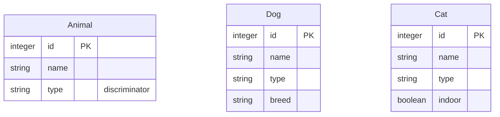
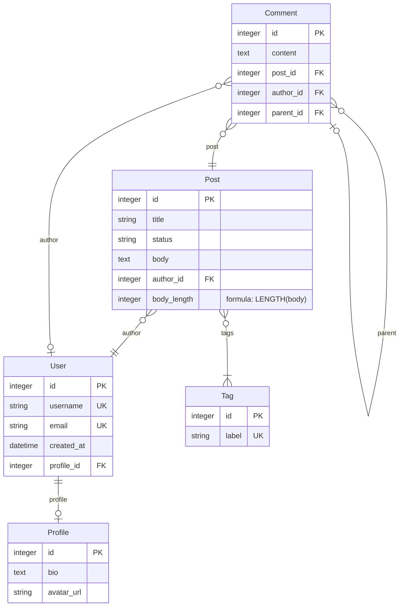
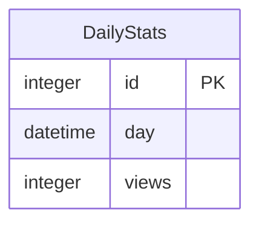
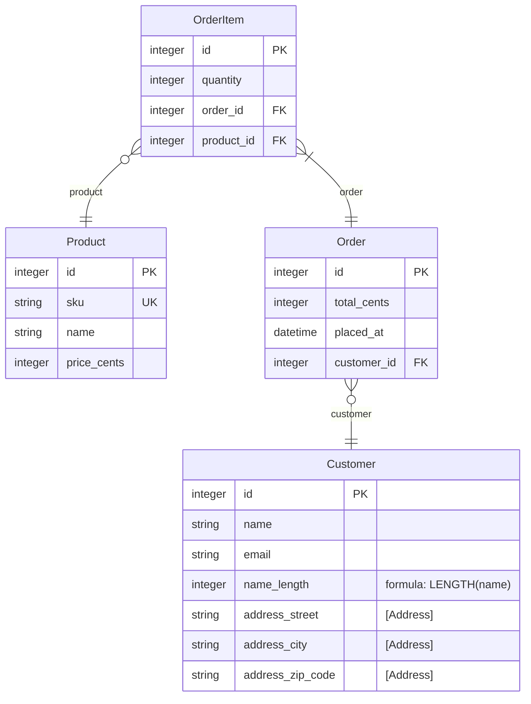

# Example Schema

Generated from the entities in examples/entities - a tour of every feature mikro-orm-markdown can render.

## Contents

- [Animals](#animals)
- [Blog](#blog)
- [Reporting](#reporting)
- [Shop](#shop)

## Animals

### Animal

*Table: `animal`*

> Base class for all animals (Single Table Inheritance root). Dog and Cat
> share one physical table, told apart by the type discriminator column.
> STI has no Prisma equivalent.

*STI root — discriminator column: `type`*

| Column | Type | Key | Nullable | Description |
|--------|------|-----|----------|-------------|
| id | integer | PK |  |  |
| name | string |  |  | Display name. |
| type | string | discriminator |  | One of: dog, cat |

**Constraints:**

- Index `animal_name_idx`: (name)

### Dog

*Table: `animal`*

> A dog — stored in the Animal table with type = 'dog'.

*Extends `Animal` (Single Table Inheritance)*

| Column | Type | Key | Nullable | Description |
|--------|------|-----|----------|-------------|
| id | integer | PK |  |  |
| name | string |  |  |  |
| type | string |  |  | One of: dog, cat |
| breed | string |  | Y | Breed, if known. |

**Constraints:**

- Index `animal_name_idx`: (name)

### Cat

*Table: `animal`*

> A cat — stored in the Animal table with type = 'cat'.

*Extends `Animal` (Single Table Inheritance)*

| Column | Type | Key | Nullable | Description |
|--------|------|-----|----------|-------------|
| id | integer | PK |  |  |
| name | string |  |  |  |
| type | string |  |  | One of: dog, cat |
| indoor | boolean |  | Y | Whether the cat is kept indoors. |

**Constraints:**

- Index `animal_name_idx`: (name)

## Blog

### User

*Table: `user`*

> A registered user who can author posts.

| Column | Type | Key | Nullable | Description |
|--------|------|-----|----------|-------------|
| id | integer | PK |  | Surrogate primary key. |
| username | string | UK |  | Unique login handle. |
| email | string | UK |  | Contact email (unique). |
| created_at | datetime |  |  | When the account was created. |
| profile_id | integer | FK (profile) | Y | Optional one-to-one profile; this side owns the foreign key. |

### Tag

*Table: `tag`*

> A label that can be attached to many posts.

| Column | Type | Key | Nullable | Description |
|--------|------|-----|----------|-------------|
| id | integer | PK |  |  |
| label | string | UK |  | Unique, human-readable tag name. |

### Profile

*Table: `profile`*

> Extended profile information for a user.

| Column | Type | Key | Nullable | Description |
|--------|------|-----|----------|-------------|
| id | integer | PK |  |  |
| bio | text |  | Y | Free-form biography. |
| avatar_url | string |  | Y | URL of the avatar image. |

### Post

*Table: `post`*

> A blog post written by a user.

| Column | Type | Key | Nullable | Description |
|--------|------|-----|----------|-------------|
| id | integer | PK |  |  |
| title | string |  |  | Headline shown in listings. |
| status | string |  |  | One of: draft, published, archived |
| body | text |  | Y | Full article body. |
| author_id | integer | FK (author) |  | Author of the post (required — non-null relation). |
| body_length | integer |  |  | Character length of the body, computed in SQL at query time (no physical column). |

**Computed columns:**

- `body_length`: `LENGTH(body)`

### Comment

*Table: `comment`*

> A reader comment on a post, optionally threaded under a parent comment.

| Column | Type | Key | Nullable | Description |
|--------|------|-----|----------|-------------|
| id | integer | PK |  |  |
| content | text |  |  | The comment text. |
| post_id | integer | FK (post) |  | The post being commented on (required). |
| author_id | integer | FK (author) | Y | The commenting user, or null for anonymous guests (nullable relation). |
| parent_id | integer | FK (parent) | Y | Parent comment when this is a threaded reply (self-reference). |

## Reporting

### ReportSettings

*Table: `report_settings`*

> Reporting configuration. The describe tag below documents it as a table in
> the Reporting section only — it is intentionally left out of the ERD diagram.

| Column | Type | Key | Nullable | Description |
|--------|------|-----|----------|-------------|
| id | integer | PK |  |  |
| recipient | string |  |  | Email address that receives the daily report. |
| enabled | boolean |  |  | Whether the daily report is enabled. |

## Shop

### Product

*Table: `product`*

> A purchasable product.

| Column | Type | Key | Nullable | Description |
|--------|------|-----|----------|-------------|
| id | integer | PK |  |  |
| sku | string | UK |  | Stock-keeping unit (unique). |
| name | string |  |  | Display name. |
| price_cents | integer |  |  | Price in minor units; the DB column is price_cents per the naming strategy. |

**Constraints:**

- Index: (name)

### OrderItem

*Table: `order_item`*

> A single line item within an order.

| Column | Type | Key | Nullable | Description |
|--------|------|-----|----------|-------------|
| id | integer | PK |  |  |
| quantity | integer |  |  | Quantity ordered. |
| order_id | integer | FK (order) |  | The parent order (required). |
| product_id | integer | FK (product) |  | The product being ordered (required). |

### Order

*Table: `order`*

> A customer order containing at least one line item.

| Column | Type | Key | Nullable | Description |
|--------|------|-----|----------|-------------|
| id | integer | PK |  |  |
| total_cents | integer |  |  | Order total in minor units (cents). |
| placed_at | datetime |  |  | When the order was placed. |
| customer_id | integer | FK (customer) |  | Customer who placed the order (required). |

**Constraints:**

- Check `order_total_non_negative`: `total_cents >= 0`

### Customer

*Table: `customer`*

> A shop customer with an embedded address and a computed display column.

| Column | Type | Key | Nullable | Description |
|--------|------|-----|----------|-------------|
| id | integer | PK |  |  |
| name | string |  |  | Full legal name |
| email | string |  |  | Billing email. |
| name_length | integer |  |  | Number of characters in the name, computed in SQL (no physical column). |
| address_street | string | [Address] |  | Street line. |
| address_city | string | [Address] |  | City name. |
| address_zip_code | string | [Address] | Y | Optional postal / ZIP code. |

**Constraints:**

- Index `customer_name_idx`: (name)
- Unique `customer_email_uq`: (email)

**Computed columns:**

- `name_length`: `LENGTH(name)`